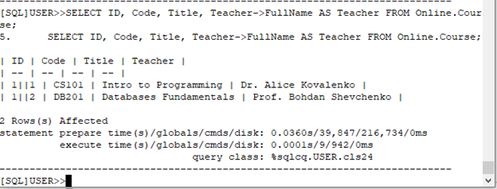
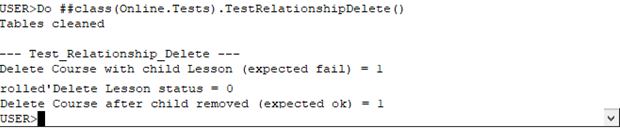

НАЦІОНАЛЬНИЙ ТЕХНІЧНИЙ УНІВЕРСИТЕТ УКРАЇНИ  
"КИЇВСЬКИЙ ПОЛІТЕХНІЧНИЙ ІНСТИТУТ ІМЕНІ ІГОРЯ СІКОРСЬКОГО”  
НАВЧАЛЬНО-НАУКОВИХ ІНСТИТУТ АТОМНОЇ ТА ТЕПЛОВОЇ ЕНЕРГЕТИКИ  
КАФЕДРА ЦИФРОВИХ ТЕХНОЛОГІЙ В ЕНЕРГЕТИЦІ  

ЛАБОРАТОРНА РОБОТА №5 
 з дисципліни "Постреляційні бази даних"  

Виконав: студент групи ТР-52мп  
Томін Владислав Вікторович 
Перевірив: Волков Олександр Володимирович 

 Київ – 2025
 
---
**МЕТА РОБОТИ:**

Додати до одного з класів завжди обчислювану властивість та реалізувати метод-геттер. Створити код автоматичної генерації даних для всіх розроблених класів. Реалізувати модульні тести, які перевіряють: створення об’єкта; унікальні, обов’язкові та обмежені властивості; поведінку при видаленні об’єкта, який має підлеглі елементи; успішне видалення об’єкта після усунення підлеглих елементів.

---
**ХІД РОБОТИ**

**Додавання завжди обчислюваної властивості**

У клас Course була додана властивість, яка завжди рахується автоматично — довжина текстового поля (без збереження в базі).
Для цього створено обчислювану властивість та метод-геттер.
Property TitleLength As %Integer [ Calculated ];
Method TitleLengthGet() As %Integer
{
    Quit $Length(..Title)
}

 
В терміналі виконується відкриття об’єкта та вивід обчисленого значення.
Отримано правильний результат — довжина назви курсу дорівнює 20 символам.

 Автоматична генерація даних
Було створено клас Online.Seed, який автоматично створює об’єкти всіх типів: телефони, викладачі, студенти, школа, курси, уроки та навчальні матеріали.
Фрагмент коду генерації:
Set c1=##class(Online.Course).%New()
Set c1.Code="CS101"
Set c1.Title="Intro to Programming"
Set c1.School=sch
Set c1.Teacher=t1
Do c1.Tags.Insert("programming")
Do c1.%Save()

 

Генерація працює коректно — після її виконання таблиці містять наповнені дані. Генератор виконується командою:

Do ##class(Online.Seed).Run()

 

**Тест створення об’єктів**

Перевіряється, що всі об’єкти успішно створюються та зберігаються.

 
Усі об’єкти створено успішно — статуси дорівнюють 1.

**Тест унікальних і обов’язкових властивостей**

Перевіряється:

- унікальність email студента (збереження дублікату має завершитись помилкою);  
- обов’язковість назви курсу (курс без назви не зберігається).  

 

Перший студент зберігається успішно, другий — повертає помилку.
Спроба зберегти курс без назви також завершується помилкою — що підтверджує коректність перевірок.

**Тест поведінки при видаленні об’єктів з підлеглими елементами**

видалення уроку курс успішно видаляється.

 

Тест поведінки при видаленні об’єкта, який має підлеглий елемент. Неможливість видалення підтверджує правильність налаштування зв’язку. Після видалення підлеглого елементу курс видаляється.

---
**ВИСНОВКИ**

У ході роботи було: 
•	Додано завжди обчислювану властивість та реалізовано метод-геттер.  

•	Реалізовано генератор даних, який автоматично створює повноцінний набір об’єктів усіх класів. 

•	Написано модульні тести, які повністю покривають: 
o	створення об’єктів; 
o	обмеження унікальності та обов’язковості; 
o	поведінку при видаленні об’єктів із підлеглими даними; 
o	правильне видалення після усунення підлеглих елементів. 
Усі частини завдання виконані, логіка роботи системи перевірена та підтверджена тестами. 

