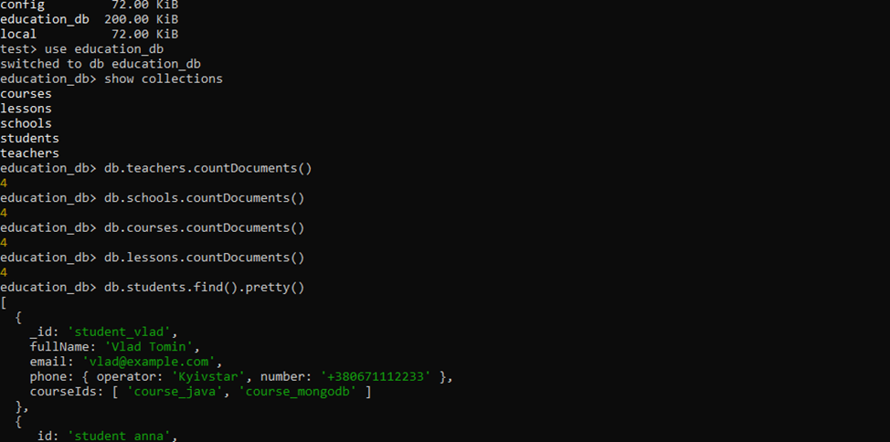
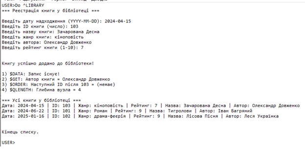
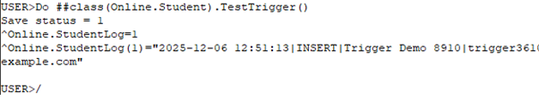
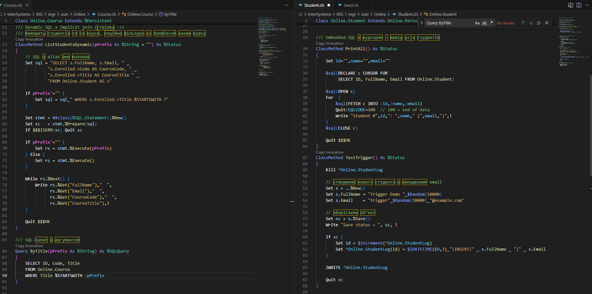

НАЦІОНАЛЬНИЙ ТЕХНІЧНИЙ УНІВЕРСИТЕТ УКРАЇНИ  
"КИЇВСЬКИЙ ПОЛІТЕХНІЧНИЙ ІНСТИТУТ ІМЕНІ ІГОРЯ СІКОРСЬКОГО”  
НАВЧАЛЬНО-НАУКОВИХ ІНСТИТУТ АТОМНОЇ ТА ТЕПЛОВОЇ ЕНЕРГЕТИКИ 
КАФЕДРА ЦИФРОВИХ ТЕХНОЛОГІЙ В ЕНЕРГЕТИЦІ  

ЛАБОРАТОРНА РОБОТА №8 
 з дисципліни "Постреляційні бази даних"  

Виконав: студент групи ТР-52мп  
Томін Владислав Вікторович 
Перевірив: Волков Олександр Володимирович 

 
 Київ – 2025

 ---
Вихідні дані: діаграма класів з Практичної роботи №3
(Student, Teacher, Phone, School, Course, Lesson, ContentItem / Lecture / Assignment / Quiz).

---
**Постановка задачі**

1.	Створити базу даних і колекції в MongoDB на основі діаграми класів з практичної роботи №3.
2.	Зв’язки типу «батько–нащадок» та вбудовані об’єкти реалізувати за допомогою вбудованої (embedded) моделі.
3.	Зв’язки «один-до-багатьох» і посилання між об’єктами реалізувати за допомогою нормалізованої (reference) моделі.
4.	Потоки (streams) не використовувати. Структуру документів будувати «здоровим глуздом», щоб вона була логічною.
5.	Створити в кожній колекції не менше 4 документів.
6.	Створити програму на Java з використанням MongoDB Java Driver, яка:  
•	підключається до MongoDB;   
•	виводить усі документи з колекцій;  
•	виконує key-value запит (фільтрація) з мінімум двома умовами;  
•	виконує агрегацію з мінімум 4 стадіями, де обов’язково є $lookup та $group.  
7.	Усі колекції, документи й запити повинні мати реальний зміст.

---
**Хід виконання**

 
 
У роботі створена база даних education_db, яка містить п’ять колекцій: студенти, викладачі, школи, курси та уроки. У кожній колекції додано по чотири документи з логічним змістом. Дані побудовані за діаграмою з лабораторної №3

 
  
У програмі на Java використано офіційний MongoDB Java Driver. Спочатку програма встановлює з’єднання з базою даних education_db, а потім послідовно викликає три функції. 
 
Перша функція зчитує і виводить усі документи з кожної колекції (students, teachers, schools, courses, lessons), щоб показати, що дані успішно отримуються. 

Друга функція виконує два запити з умовами: перший знаходить студентів, які навчаються на курсі MongoDB і мають номер телефону від оператора Kyivstar, а другий визначає лише ті уроки, які є лекціями і належать до курсу MongoDB.

Третя функція виконує агрегацію з кількох етапів, де програма під’єднує до курсів їхні уроки, розгортає вкладені документи в окремі записи, рахує кількість уроків на кожному курсі і сортує результати так, щоб спочатку показати курси з найбільшою кількістю занять. 

Усі ці операції виводяться на екран, що підтверджує коректність роботи програми та правильність структури даних у MongoDB.

---
**Висновок**

У цій лабораторній роботі я ознайомився зі створенням структурованих документів у MongoDB, правильно використав вбудовані та нормалізовані моделі зберігання даних, створив реалістичну логічну структуру відповідно до діаграми класів і підключився до неї за допомогою Java-програми. Я навчился виконувати запити, агрегації та взаємодіяти з колекціями через код. Завдання виконано повністю.
